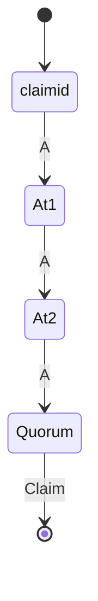
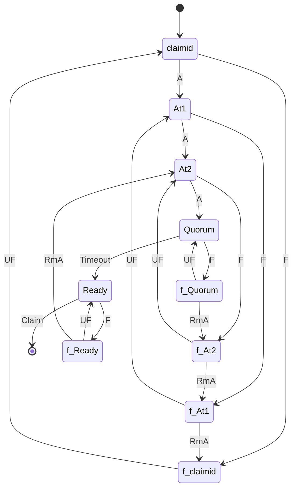

<pre>
Title:        <b>Bridge Guardians</b>
Description:  Protecting bridges from a quorum of malicious witness servers
Type:         Draft

Author:       <a href="mailto:scott.determan@ripple.com">Scott Determan (Ripple)</a>

  core_protocol_changes_required:     true
</pre>

# Bridge Guardians

This proposal is an extension of XLS-38, Cross-chain bridge and assumes
familiarity with that proposal (ref:
https://github.com/XRPLF/XRPL-Standards/tree/master/XLS-0038d-cross-chain-bridge).

The witness server operators are explicitly trusted in the current bridge
design. A quorum of witness servers can move locked funds from a door account.
The security of the design is based on choosing witness servers that are
unlikely to collude. This proposal introduces a new safeguard to the cross-chain
bridge protocol: guardians. Guardians monitor witness servers and can freeze the
bridge if they detect misbehaving witness servers. These guardians can also
change the witness servers. Of course, this introduces a new trusted entity.
Since guardians can change the witness servers (the signatures used to verify
attestations and move funds) they could use this power to steal funds. This
proposal does not eliminate the power to steal funds, but greatly reduces the
possibility for one group and moves it to a different group.

The motivation here is there exists entities that would like safeguard
sidechains, and if the entity ever acted dishonestly the harm to the entity
would be much, much larger than any benefit of the dishonesty (Ripple the
company is such an entity). This proposal allows such an entity to monitor a
sidechain and to freeze the sidechain if it is suspected of being compromised.
Additional, the entity can change witness servers, remove suspected fraudulent
attestations, set limits on reward amounts and delays, and unfreeze the
sidechain.

At a high level, this proposal introduces the following changes:

1. The ability to restrict transactions to particular signer's lists. The
multiple signer's list amendment will need to be finalized and implemented
before we can make the changes described in this proposal. (ref:
https://github.com/XRPLF/XRPL-Standards/discussions/144)
2. Changing existing attestation and claim transaction so funds cannot move
until a timeout period has expired. The timeout starts when a quorum of
attestations has been reached. The delay allows the bridge to be frozen if the
bridge is compromised.
3. A guardian's signer list with the ability to freeze the bridge, unfreeze the
bridge, set the delay, set the witness server's signer's list, and remove
attestations from a frozen bridge.
4. A witness's signers list that will be used to verify attestations. This
signer's list may be used to submit a transaction of self-modify the witness's
signers list. This signers list may not submit other transactions (such as
making a payment or changing the guardian's list).
5. A new transaction to freeze the bridge.
6. A new transaction to unfreeze the bridge.
7. A new transaction to remove attestations from a claim id that are not currently
part of the witness server's signer's list.
8. A new transaction to modify bridge limits like min delay time and max reward
   amounts.
9. A new transacton to finish cross chain account creates (a new type of `claim`
   transaction).

Given the delay built into cross-chain transactions that create new wrapped
assets (or redeem old wrapped assets), it is expected that atomic swaps will be
used to swap already wrapped asset on one chain for the asset on the other
chain. (TODO: Do we need a mechanism to advertise the desire to do such a swap?).

## 1. Introduction

### 1.1. Terminology

- **Bridge**: A method of moving assets from one blockchain to another.
- **Locking chain**: The chain on which the assets originate. An asset is locked
  on this chain before it can be represented on the issuing chain, and will
  remain locked while the issuing chain uses the asset.
- **Issuing chain**: The chain on which the assets from the locking chain are
  wrapped. The issuing chain issues assets that represent assets that are locked
  on the locking chain.
- **Cross-chain transfer**: A protocol that moves assets from the locking chain
  to the issuing chain, or returns those assets from the issuing chain back to
  the locking chain. This generally means that the locking chain locks and
  unlocks a token, while the issuing chain mints and burns a wrapped version of
  that token. Usually (but not always), the mainchain will be locking and
  unlocking a token, and the sidechain will be minting and burning the wrapped
  version.
- **Source chain**: The chain that a cross-chain transfer begins from. The
  transfer is from the source chain and to the destination chain.
- **Destination chain**: The chain that a cross-chain transfer ends at. The
  transfer is from the source chain and to the destination chain.
- **Door account**: The account on the locking chain that is used to put assets
  into trust, or the account on the issuing chain used to issue wrapped assets.
  The name comes from the idea that a door is used to move from one room to
  another and a door account is used to move assets from one chain to another.
- **Attestation**: A message signed by a witness server attesting to a
  particular event that happened on the other chain. This is used because chains
  don't talk to each other directly.
- **Witness server**: A server that listens for transactions on one or both of
  the chains and signs attestations used to prove that certain events happened
  on a chain.
- **Guardian server**: A server similar to a witness server. It listens for
  transactions on one or both of the chains and watches for witness servers that
  attest to events that did not occur.
- **Cross-chain claim ID**: A ledger object used to prove ownership of the funds
  moved in a cross-chain transfer. This object represents a unique ID for each
  cross-chain transfer.
- **Witness's signer list**: The keys used to verify attestations. Each key is
  owned by some witness server.
- **Guardian's signer list**: The keys used to freeze and unfreeze the bridge.
  Each key is owned by some guardian server.
- **Atomic Swap**: A trustless way to swap assets between two blockchains.

### 1.2. The Guardian Server

A guardian server is an independent server that helps protect against malicious
or compromised witness servers. Unlike the witness server, it does not attest to
events on the chains. Instead it attempts to detect when witness servers are
compromised and has the power to freeze the bridge and replace witness servers.

Given the similarity in requirements between guardian servers and witness
servers, it is likely they will share a common code base and the role will be
changed based on a configuration file. The criteria that a guardian uses to
decide when to freeze a bridge is up to the guardian or replace witness servers,
but it would likely be triggered if a witness server attested to non-existent
events.

### 1.2. The Witness Server

#### 1.2.1 Current Witness Server

The existing witness server is described in the XLS-38 spec as follows:

A witness server is an independent server that helps provide proof that an event
happened on either the locking chain or the issuing chain. It listens to
transactions on one side of the bridge and submits attestations on the other
side. This helps affirm that a transaction on the source chain occurred. The
witness server is acting as an oracle, providing information to help prove that
the assets were moved to the door account on the source chain (to be locked or
burned). This then allows the recipient of those assets to claim the equivalent
funds on the destination chain.

Since submitting a signature requires submitting a transaction and paying a fee,
supporting rewards for signatures is an important requirement. The reward could
be higher than the fee, providing an incentive for running a witness server.

#### 1.2.1 Changes to the Witness Server

Since this design introduces a "SettleDelay" in transactions, all transactions
will require a "claim" transaction. Witness servers do not normally submit
"claim" transactions, but will be required to do so to complete a cross-chain
create account transaction.

The witness server also needs to be modified to pause when a bridge is frozen
and to re-send transactions if attestations are removed by guardians (re-sending
attestations may be challenging).

### 1.3. Design Overview

In addition to the changes required to support multiple signer's list, this
design adds 1 new server type, modifies 3 ledger objects, adds 6 new
transactions, and modifies 6 existing transactions.

The new server type is:

- The guardian server

The modified ledger objects are:

- `Bridge`
- `XChainOwnedClaimID`
- `XChainOwnedCreateAccountClaimID`

The new transactions are:

- `XChainFreeze`
- `XChainUnfreeze`
- `XChainRemoveClaimAttestations`
- `XChainRemoveAccountCreateAttestations`
- `XChainModifyBridgeLimits`
- `XChainClaimAccountCreate`

The modified transactions are:
- `XChainCreateBridge`
- `XChainModifyBridge`
- `XChainCommit`
- `XChainAddClaimAttestation`
- `XChainClaim`
- `XChainAddAccountCreateAttestation`

#### 1.3.1. A Cross-Chain Transfer

##### 1.3.1.2. Process

The existing steps to transfer funds from an account on the source chain to an
account on the destination chain are:

1.  The user creates a cross-chain claim ID on the destination chain, via the
    **`XChainCreateClaimID`** transaction. This creates a
    **`XChainOwnedClaimID`** ledger object. The ledger object must specify the
    source account on the source chain.
2.  The user submits a **`XChainCommit`** transaction on the source chain,
    attaching the claimed cross-chain claim ID and including a reward amount
    (`SignatureReward`) for the witness servers. This locks or burns the asset
    on the source chain, depending on whether the source chain is a locking or
    issuing chain. This transaction must be submitted from the same account that
    was specified when creating the claim ID.
3.  The **witness server** signs an attestation saying that the funds were
    locked/burned on the source chain. This is then submitted as a
    **`XChainAddClaimAttestation`** transaction on the destination chain.
4.  When there is a quorum of witness attestations, the funds can be claimed on
    the destination chain. If a destination account is included in the initial
    transfer, then the funds automatically transfer when quorum is reached.
    Otherwise, the user can submit a **`XChainClaim`** transaction for the
    transferred value on the destination chain.
    - The rewards are then automatically distributed to the witness servers’
      accounts on the destination chain.

It's easy to visualize the different states on the destination chain as a state
diagram. The states At1 and At2 represent a claimid with 1 or 2 attestations,
and the quorum is 3. The event "A" represents a new attestation being added.
Here is the state diagram:

The new steps to transfer funds from their account on the source chain to their
account on the destination chain are shown below. Changes from the existing
steps are shown in red:

1.  The user creates a cross-chain claim ID on the destination chain, via the
    **`XChainCreateClaimID`** transaction. This creates a
    **`XChainOwnedClaimID`** ledger object. The ledger object must specify the
    source account on the source chain.
2.  The user submits a **`XChainCommit`** transaction on the source chain,
    attaching the claimed cross-chain claim ID and including a reward amount
    (`SignatureReward`) for the witness servers. This locks or burns the asset
    on the source chain, depending on whether the source chain is a locking or
    issuing chain. This transaction must be submitted from the same account that
    was specified when creating the claim ID.
3.  The **witness server** signs an attestation saying that the funds were
    locked/burned on the source chain. This is then submitted as a
    **`XChainAddClaimAttestation`** transaction on the destination chain.
4.  When there is a quorum of witness attestations, a
    "FinishAfter" time is set. This time will be the current ledger close time
    plus the bridge's "SettleDelayTime". Funds cannot be claimed until after
    this finish time.
5. Once the ledger close time is greater than the
   "FinishAfter time, the user must submit a **`XChainClaim`** transaction for
   the transferred value on the destination chain.
    - The rewards are then automatically distributed to the witness servers’
      accounts on the destination chain.

The changes proposed here introduce some new events: 

1. A freeze. Event "F" represents a freeze event (and states with a "f_" prefix
   represent states that are frozen).
2. An un-freeze. Event "UF" represents an unfreeze.
3. Removing an attestation. Event "RmA" represents removing an attestation.
4. Timeout. This represents a required waiting period before funds may be moved.

Here is the state diagram of the new steps showing freeze, unfreeze, and remove
attestation events:

Note that the two state diagrams above are abstractions and hides some details
(one example: events are shown if they would loop back to the same state), but
it gives a good high-level description of the states.

#### 1.3.2. Freezing a bridge

The guardian group can submit a **`XChainFreeze`** transaction to freeze
the bridge. They will do this if they observe suspicious activities from witness
servers, and due to the settle delay, can freeze a bridge before assets are
actually moved. There are several consequences to freezing a bridge. If a bridge
is frozen then:

1.  Any `XChainCreateBridge`, `XChainModifyBridge`, `XChainCommit`, `XChainAddClaimAttestation`,
   `XChainClaim`, or `XChainAddAccountCreateAttestation` will fail with a tec
   code.
2. Attempting to change the witness server's signers list by submitting a
   transaction signed by the witness servers signer list will fail with a tec
   code. If this bridge is unfrozen this is allowed to succeed.
3. An `XChainRemoveAttestations` transaction is allowed to succeed (if signed by
   the guardian's signer list). This transaction will always fail with a tec
   code if the bridge is unfrozen.

#### 1.3.2. Setting Up a Cross-Chain Bridge

The current steps to set up a bridge are:

1.  The witness server(s) are spun up.
2.  The bridge is initialized on both of the chains via **`XChainCreateBridge`**
    transactions sent by the door accounts, which creates a **`Bridge`** ledger
    object on each chain. Each chain has a **door account** that controls that
    end of the bridge on-chain. On one chain, currency is locked and unlocked
    (the **locking chain**). On the other chain, currency is minted and burned,
    or issued and reclaimed (the **issuing chain**).
    - The `Bridge` ledger object can be modified via the **`XChainModifyBridge`** transaction.
3.  Both chains’ door accounts set up a signer list (via a `SignerListSet`
    transaction) using the witness servers’ signing keys, so that they control
    the funds that the bridge controls.
4.  Both chains’ door accounts disable the master key (via an `AccountSet`
    transaction), so that the witness servers as a collective have total control
    of the bridge.
    
The new steps are shown below. Changes from the existing steps are shown in red.

1.  The witness server(s) are spun up.
2.  The bridge is initialized on both of the chains via **`XChainCreateBridge`**
    transactions sent by the door accounts, which creates a **`Bridge`** ledger
    object on each chain. Each chain has a **door account** that controls that
    end of the bridge on-chain. On one chain, currency is locked and unlocked
    (the **locking chain**). On the other chain, currency is minted and burned,
    or issued and reclaimed (the **issuing chain**).
    - The `Bridge` ledger object can be modified via the
      **`XChainModifyBridge`** transaction.
3.  Both chains’ door accounts set up a witness
    server's signer list (via a to-be-proposed `SignerListSetNamed` transaction)
    using the witness servers’ signing keys. This signers list must be set up to
    be disabled when the bridge is frozen and will be restricted to being used
    to verify attestations, changing the witness servers's signer list or
    submitting **`XChainModifyBridge`** transactions.
3.   Both chains’ door accounts set up a guardian's
    signer list (via a to-be-proposed `SignerListSetNamed` transaction) using
    the guardian servers’ signing keys. This signers list must be set up to be
    restricted to modifying the witness servers' signers list, the guardians'
    servers' signers list, or submitting **`XChainFreeze`**,
    **`XChainUnfreeze`**, **`XChainRemoveAttestations`**, or
    **`XChainRemoveModifyBridgeLimits`** transactions.
4.  Both chains’ door accounts disable the master key (via an `AccountSet`
    transaction), so that the witness servers  and
    guardian servers as a collective have total control of the bridge.

## 2. Changes to the XRPL

### 2.1. Changes to On-Ledger Objects

#### 2.1.1. Changes to the **`Bridge`** object

A **`Bridge`** is an object that describes a single cross-chain bridge.

##### 2.1.1.1. Fields

A **`Bridge`** object has the following fields:

| Field Name                 | Required? | JSON Type         | Internal Type   |
|----------------------------|-----------|-------------------|-----------------|
| `LedgerIndex`              | ✔️         | `string`          | `HASH256`       |
| `XChainBridge`             | ✔️         | `XChainBridge`    | `XCHAIN_BRIDGE` |
| `SignatureReward`          | ✔️         | `Currency Amount` | `AMOUNT`        |
| `MinAccountCreateAmount`   |           | `Currency Amount` | `AMOUNT`        |
| `XChainAccountCreateCount` | ✔️         | `number`          | `UINT64`        |
| `XChainAccountClaimCount`  | ✔️         | `number`          | `UINT64`        |
| `XChainClaimID`            | ✔️         | `number`          | `UINT64`        |

This proposal introduces the following new fields:

| Field Name                | Required? | JSON Type         | Internal Type |
|---------------------------|-----------|-------------------|---------------|
| `SettleDelayMinLimit`     | ✔️         | `number`          | `INT32`       |
| `SignatureRewardMaxLimit` | ✔️         | `Currency Amount` | `AMOUNT`      |
| `SettleDelay`             | ✔️         | `number`          | `INT32`       |
| `WitnessSignersList`      | ✔️         | `TBD`             | `TBD`         |
| `GuardianSignersList`     | ✔️         | `TBD`             | `TBD`         |

###### 2.1.1.1.1. `SettleDelayMinLimit`

The minimum settle delay that the bridge can be set to. This helps prevent an attack where the settle delay
is shorter than the time needed by the guardians to notice misbehaving witness servers and freeze the bridge.
If the witness server list uses the `XChainModifyBridge` command to change the `SettleDelay`, it will fail it the
settle delay is below this limit. Only the guardian list is allowed to change this limit by using the `XChainModifyBridgeLimits` transaction.

###### 2.1.1.1.2. `SignatureRewardMaxLimit`

The maximum signature reward that the bridge can be set to. This helps prevent
an attack where a large reward amount is used by the witness servers to
effectively freeze the bridge. If the witness server list uses the
`XChainModifyBridge` command to change the `SignatureReward`, it will fail it
the amount is above this limit.

###### 2.1.1.1.3. `SettleDelay`

The minimum amount of time that must elapse between reaching a quorum of attestations and successfully running a `XChainClaim` transaction. The purpose of this delay is to give guardian servers enough time to notice misbehaving witness servers and freeze the bridge.

###### 2.1.1.1.3. `WitnessSignersList`

The signers list used to verify attestations and run a restricted set of
transactions on the bridge. Note: this depends on a to-be-specified "Multiple
Signer Lists" feature.

###### 2.1.1.1.3. `GuardianSignersList`

The signers list used to freeze the bridge, remove problematic attestations from
a compromised bridge, set bridge limits, and remove misbehaving witness servers.
Note: this depends on a to-be-specified "Multiple Signer Lists" feature.

#### 2.1.2. `XChainClaimID`

A **`XChainOwnedClaimID`** is an object that describes a single cross-chain claim ID.

##### 2.1.2.1. Fields

A **`XChainOwnedClaimID`** object has the following fields:

| Field Name                | Required? | JSON Type         | Internal Type   |
| ------------------------- | --------- | ----------------- | --------------- |
| `LedgerIndex`             | ✔️        | `string`          | `HASH256`       |
| `XChainBridge`            | ✔️        | `XChainBridge`    | `XCHAIN_BRIDGE` |
| `OtherChainSource`        | ✔️        | `string`          | `ACCOUNT`       |
| `SignatureReward`         | ✔️        | `Currency Amount` | `AMOUNT`        |
| `XChainClaimAttestations` | ✔️        | `array`           | `ARRAY`         |
| `XChainClaimID`           | ✔️        | `string`          | `UINT64`        |

This proposal introduces the following new fields:

| Field Name    | Required? | JSON Type | Internal Type |
|---------------|-----------|-----------|---------------|
| `FinishAfter` | ️          | `number`  | `UINT32`      |

###### 2.1.2.1.1. `FinishAfter`

The minimum ledger close time required for a `XChainClaim` transaction to succeed.

#### 2.1.3. The **`XChainOwnedCreateAccountClaimID`** object

A **`XChainOwnedCreateAccountClaimID`** is an object that describes an account
to be created on the issuing chain.

##### 2.1.3.1. Fields

A **`XChainOwnedCreateAccountClaimID`** object has the following fields:

| Field Name                        | Required? | JSON Type      | Internal Type   |
| --------------------------------- | --------- | -------------- | --------------- |
| `LedgerIndex`                     | ✔️        | `string`       | `HASH256`       |
| `XChainBridge`                    | ✔️        | `XChainBridge` | `XCHAIN_BRIDGE` |
| `XChainAccountCreateCount`        | ✔️        | `number`       | `UINT64`        |
| `XChainCreateAccountAttestations` | ✔️        | `array`        | `ARRAY`         |

This proposal introduces the following new fields:

| Field Name    | Required? | JSON Type | Internal Type |
|---------------|-----------|-----------|---------------|
| `FinishAfter` | ️          | `number`  | `UINT32`      |

###### 2.1.2.1.1. `FinishAfter`

The minimum ledger close time required for a `XChainClaim` transaction to succeed.

### 2.2. Changes to Existing Transactions

#### 2.2.1. Changes to the **`XChainCreateBridge`** transaction

The **`XChainCreateBridge`** transaction creates a new `Bridge` ledger object.
This tells one chain (whichever chain the transaction is submitted on) the
details of the bridge.

##### 2.2.1.1. Fields

The `XChainCreateBridge` transaction has the following fields:

| Field Name               | Required? | JSON Type         | Internal Type   |
| ------------------------ | --------- | ----------------- | --------------- |
| `XChainBridge`           | ✔️        | `XChainBridge`    | `XCHAIN_BRIDGE` |
| `SignatureReward`        | ✔️        | `Currency Amount` | `AMOUNT`        |
| `MinAccountCreateAmount` |           | `Currency Amount` | `AMOUNT`        |

This proposal introduces the following new fields:

| Field Name                | Required? | JSON Type         | Internal Type |
|---------------------------|-----------|-------------------|---------------|
| `SettleDelayMinLimit`     | ✔️         | `number`          | `INT32`       |
| `SignatureRewardMaxLimit` | ✔️         | `Currency Amount` | `AMOUNT`      |
| `SettleDelay`             | ✔️         | `number`          | `INT32`       |
| `WitnessSignersList`      | ✔️         | `TBD`             | `TBD`         |
| `GuardianSignersList`     | ✔️         | `TBD`             | `TBD`         |

The new fields are described in section 2.1.1.1 when describing the **`Bridge`**
ledger object.

#### 2.2.2. The **`XChainModifyBridge`** transaction

The `XChainModifyBridge` transaction allows witness servers managers to modify
the parameters of the bridge. They can only change the `SignatureReward`,
`SettleDelay` and the `MinAccountCreateAmount` and these values must fall into
the limits set by `SettleDelayMinLimit` and `SignatureRewardMaxLimit`.

If the bridge is frozen, this transaction will always fail with a tec code.

Note that this is a regular transaction that is sent by the door account and
requires the entities that control the witness servers to coordinate and provide
the signatures for this transaction. This coordination happens outside the
ledger.

Note that the signer list for the bridge is not modified through this
transaction. The signer list is on the door account itself and is changed in the
same way signer lists are changed on accounts (via a `SignerListSet`
transaction).

##### 2.2.2.1. Fields

The `XChainModifyBridge` transaction has the following fields:

| Field Name               | Required? | JSON Type         | Internal Type   |
| ------------------------ | --------- | ----------------- | --------------- |
| `XChainBridge`           | ✔️        | `XChainBridge`    | `XCHAIN_BRIDGE` |
| `SignatureReward`        |           | `Currency Amount` | `AMOUNT`        |
| `MinAccountCreateAmount` |           | `Currency Amount` | `AMOUNT`        |
| `Flags`                  | ✔️        | `number`          | `UINT32`        |

This proposal introduces the following new fields:

| Field Name    | Required? | JSON Type | Internal Type |
|---------------|-----------|-----------|---------------|
| `SettleDelay` | ️          | `number`  | `INT32`       |

###### 2.2.2.1.1. `SettleDelay`

The minimum amount of time that must elapse between reaching a quorum of attestations and successfully running a `XChainClaim` transaction. The purpose of this delay is to give guardian servers enough time to notice misbehaving witness servers and freeze the bridge.

### 2.2.3. The **`XChainCommit`** transaction

If the bridge is frozen, this transaction will always fail with a tec code.
Apart from that, this transaction is unchanged from the current implementation.

### 2.2.3. The **`XChainAddClaimAttestation`** transaction

There are two proposed changes to this transaction:

1. If the bridge is frozen, this transaction will always fail with a tec code.
2. This transaction will no longer move funds when the quorum is reached.
   Instead, it will set the `FinishAfter` field on the `XChainOwnedClaimID`
   ledger object. A `XChainClaim` transaction is required to move funds after
   the timeout has expired.

There are no new proposed fields on this transaction.

### 2.2.3. The **`XChainClaim`** transaction

There are two proposed changes to this transaction:

1. If the bridge is frozen, this transaction will always fail with a tec code.
2. If the `XChainOwnedClaimID` `FinishAfter` timestamp is greater than or equal
   to the current ledger time, the transaction will fail with a tec code.

There are no new proposed fields on this transaction.

#### 2.2.4. The **`XChainAddAccountCreateAttestation`** transaction

There are two proposed changes to this transaction:

1. If the bridge is frozen, this transaction will always fail with a tec code.
2. This transaction will no longer move funds when the quorum is reached.
   Instead, it will set the `FinishAfter` field on the `XChainOwnedClaimID`
   ledger object. A `XChainClaimAccountCreate` transaction is required to move funds after
   the timeout has expired.

There are no new proposed fields on this transaction.

### 2.3. New Transactions

#### 2.3.1. The **`XChainFreeze`** Transaction

The `XChainFreeze` transaction is used by the guardians to freeze the
bridge. After a bridge freeze, all normal bridge transactions will fail. The
guardian group can use this bridge freeze to remove attestations using the
`XChainRemoveAttestations` transaction. They can also change the witness server
list to remove misbehaving witness servers.

##### 2.3.1.1. Fields

The `XChainFreeze` transaction contains the following fields:

| Field Name              | Required? | JSON Type         | Internal Type   |
| ----------------------- | --------- | ----------------- | --------------- |
| `XChainBridge`          | ✔️        | `XChainBridge`    | `XCHAIN_BRIDGE` |

###### 2.3.1.1.1. `XChainBridge`

Which bridge to freeze.

#### 2.3.2. The **`XChainUnfreeze`** Transaction

The `XChainUnfreeze` transaction is used by the guardians to unfreeze the
bridge. After a bridge unfrozen, all normal bridge transactions can proceed
normally.

##### 2.3.1.1. Fields

The `XChainUnfreeze` transaction contains the following fields:

| Field Name              | Required? | JSON Type         | Internal Type   |
| ----------------------- | --------- | ----------------- | --------------- |
| `XChainBridge`          | ✔️        | `XChainBridge`    | `XCHAIN_BRIDGE` |

###### 2.3.1.1.1. `XChainBridge`

Which bridge to unfreeze.

#### 2.3.3. The **`XChainRemoveClaimAttestations`** Transaction

The `XChainRemoveClaimAttestations` removes all the attestations from a claim id
and resets the `FinishAfter` field, if present.

This transaction will fail with a tec code if the bridge is not currently
frozen, and this transaction may only be signed with the guardian's signers list.

##### 2.3.3.1. Fields

The `XChainRemoveClaimAttestations` transaction contains the following fields:

| Field Name                 | Required? | JSON Type         | Internal Type   |
| -------------------------- | --------- | ----------------- | --------------- |
| `WasLockingChainSend`      | ✔️        | `number`          | `UINT8`         |
| `XChainBridge`             | ✔️        | `XChainBridge`    | `XCHAIN_BRIDGE` |
| `XChainClaimID`            | ✔️        | `string`          | `UINT64`        |

###### 2.3.3.1.1. `WasLockingChainSend`

A boolean representing the chain where the event occurred.

###### 2.3.3.1.2. `XChainBridge`

The bridge associated with the attestations.

###### 2.3.3.1.3. `XChainClaimID`

The `XChainOwnedClaimID` to remove attestations from.

#### 2.3.4. The **`XChainRemoveAccountCreateAttestations`** Transaction

The `XChainRemoveAccountCreateAttestations` removes all the attestations from a
create account claim id and resets the `FinishAfter` field, if present.

This transaction will fail with a tec code if the bridge is not currently
frozen, and this transaction may only be signed with the guardian's signers list.

##### 2.3.4.1. Fields

The `XChainRemoveAccountCreateAttestation` transaction contains the following fields:

| Field Name                 | Required? | JSON Type         | Internal Type   |
| -------------------------- | --------- | ----------------- | --------------- |
| `WasLockingChainSend`      | ✔️        | `number`          | `UINT8`         |
| `XChainBridge`             | ✔️        | `XChainBridge`    | `XCHAIN_BRIDGE` |
| `XChainAccountCreateCount` | ✔️        | `string`          | `UINT64`        |

###### 2.3.4.1.1. `WasLockingChainSend`

A boolean representing the chain where the event occurred.

###### 2.3.4.1.2. `XChainBridge`

The bridge associated with the attestations.

###### 2.3.4.1.3. `XChainAccountCreateCount`

The `XChainOwnedCreateAccountClaimID` to remove attestations from.

#### 2.3.5. The **`XChainModifyBridgeLimits`** Transaction

The `XChainModifyBridge` transaction changes the `SettleDelayMinLimit` and
`SignatureRewardMaxLimit`. This can only be submitted with the guardian's
signers list. If the limits are more restrictive than the current values on the
bridge, the values on the bridge are changed to bring them into the new
specified range.

##### 2.3.4.1. Fields

The `XChainModifyBridgeLimits` transaction contains the following fields:

| Field Name                | Required? | JSON Type         | Internal Type   |
|---------------------------|-----------|-------------------|-----------------|
| `XChainBridge`            | ✔️         | `XChainBridge`    | `XCHAIN_BRIDGE` |
| `SettleDelayMinLimit`     | ️          | `number`          | `INT32`         |
| `SignatureRewardMaxLimit` | ️          | `Currency Amount` | `AMOUNT`        |

#### 2.3.6. The **`XChainClaimAccountCreate`** Transaction

The `XChainClaimAccount` transaction finishes a cross-chain account create
transactions started by a `XChainCreateAccountCommit` transaction. allows the
user to claim funds on the destination chain from a `XChainCommit` transaction.

If the bridge is frozen, this transaction will always fail with a tec code. If
the `XChainOwnedAccountCreateClaimID` `FinishAfter` timestamp is greater than or
equal to the current ledger time, the transaction will fail with a tec code.

##### 2.3.6.1. Fields

The `XChainClaimAccountCreate` transaction contains the following fields:

| Field Name                 | Required? | JSON Type         | Internal Type   |
|----------------------------|-----------|-------------------|-----------------|
| `XChainBridge`             | ✔️         | `XChainBridge`    | `XCHAIN_BRIDGE` |
| `XChainAccountCreateCount` | ✔️         | `string`          | `UINT64`        |
| `Amount`                   | ✔️         | `Currency Amount` | `AMOUNT`        |

###### 2.3.6.1.1. `XChainBridge`

The bridge associated with this account create.

###### 2.3.6.1.2. `XChainAccountCreateCount`

The unique integer ID for this a cross-chain account create.

###### 2.3.6.1.3. `Amount`

The amount to use to create the account on the destination chain.

This must match the amount attested to on the attestations associated with this
`XChainAccountCreateCount`.

